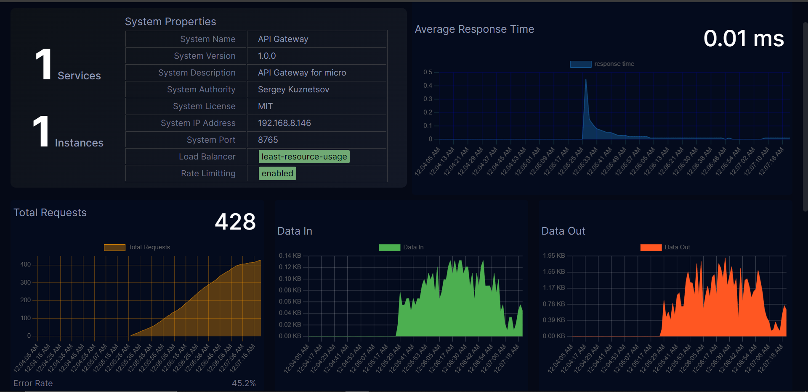
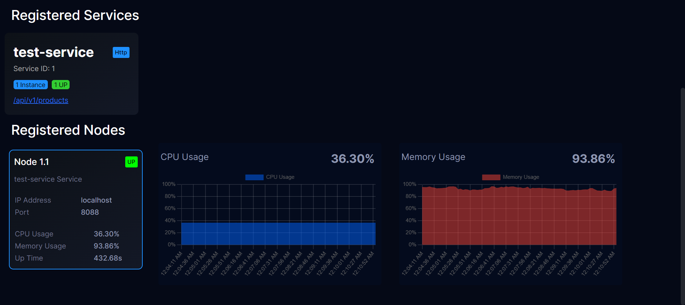

# BitMonX Discovery Server (BDS)

## Introduction

BitMonX Discovery Server (BDS) is a server designed to facilitate the discovery of services within a network environment, especially in a multi-service (microservice) setup. It works in tandem with the BitMonX Discovery Client (BDC) which is integrated with the services. BDS is a lightweight discovery server built entirely using Node.js. Once the services are initialized with the BDC client, they can register themselves and connect with the BDS discovery server to both announce their presence and locate other services running on the network.

In addition to service discovery, BDS offers server-side load balancing, API gateways, rate limiting, and more.

Furthermore, the BDS server includes a built-in, secure, and lightweight real-time dashboard to monitor both the services and the server itself.

## Features

- **Automatic Service Registration**:

  Services can register themselves with the BDS server through their BDC client automatically. The services can also deregister themselves when they are shutting down or when needed.

- **Service Discovery**:

  Services can discover other services running on the network through the BDS server. BDS exposes simple REST API to simply query the services clients wants.

- **Server Side Load Balancing**:

  BDS server can act as a load balancer for the services running on the network. It can distribute the incoming requests to the services based on specified load balancing algorithm.

- **API Gateway**:

  BDS server can act as an API gateway for the services running on the network. It can route the incoming requests to the appropriate services based on the request path and the load balancing algorithm.

- **Rate Limiting and Throttling**:

  BDS server can rate limit the incoming requests to the services based on the specified rate limit configuration. It can also throttle the incoming requests based on the specified throttle configuration. For the ratelimiting and throttling, BDS uses the Token Bucket algorithm.

- **Realtime Dashboard**:

  The BDS server includes an integrated secure real-time dashboard crafted to monitor the services and the server itself. This dashboard is constructed using socket.io and chart.js.

  The dashboard furnishes crucial information about services and nodes, as well as additional insights into their operational health and performance. It also tracks global API metrics such as incoming requests, average response time, data throughput, and more.

  Furthermore, user access to the dashboard requires authentication, which is accomplished through simple token-based authentication. There are plans to implement more sophisticated secure authentication methods in the future.

## Installation

Install the package using npm:

```shell
npm install bitmonx-discovery-server
```

## Usage

First, create a json config file name bitmonx.config.json in the root of your project. The file should contain the following fields:

```json
{
  "info": {
    "name": "API Gateway",
    "version": "1.0.0",
    "description": "API Gateway for micro",
    "author": "Sergey Kuznetsov",
    "license": "MIT"
  },
  "server": {
    "ipaddress": "0.0.0.0",
    "port": 8765
  },
  "loadbalancer": {
    "algorithm": "round-robin"
  },
  "ratelimiting": {
    "fillRate": 10,
    "capacity": 1000
  },
  "health_check_interval": 5000,
  "api_stat_send_interval": 5000
}
```

Then, simply call the discovery method by passing optional logger instances:

```javascript
const { discovery } = require('bitmonx-discovery-server');

// Optional logger instance
discovery(logger);
```

The server will start on the specified port and automatically configure itself based on the provided configurations. It will also initiate the real-time dashboard on the specified routes below.

`/bitmonx/dashboard`

## Configurations

| Field                  | Description                                                                                          | Default Value | Required |
| ---------------------- | ---------------------------------------------------------------------------------------------------- | ------------- | -------- |
| info.name              | Name of the server                                                                                   | -             | Yes      |
| info.version           | Version of the server                                                                                | -             | Yes      |
| info.description       | Description of the server                                                                            | -             | No       |
| info.author            | Author of the server                                                                                 | -             | No       |
| info.license           | License of the server                                                                                | -             | No       |
| server.ipaddress       | IP Address of the server                                                                             | -             | Yes      |
| server.port            | Port of the BDS server                                                                               | 8765          | No       |
| loadbalancer.algorithm | Load balancing algorithm to routes the requets                                                       | round-robin   | No       |
| ratelimiting.fillRate  | Rate limit fill rate (which is used to ratelimiting the API gateway)                                 | -             | No       |
| ratelimiting.capacity  | Rate limit capacity (which is used to throttle the API gateway)                                      | -             | No       |
| health_check_interval  | The rate at which the BDS server check on the health on each BDC client in milliseconds              | 5000          | No       |
| api_stat_send_interval | The rate at which the BDS serever send API gateway statistical data to the dashboard in milliseconds | 5000          | No       |

### Load Balancing Algorithms

There are a total of 5 load balancing algorithms implemented in the BDS server. While three of them are static load balancing algorithms, the other two are dynamic load balancing algorithms.

- config field: `loadbalancer.algorithm`
- valid algorithms (values): `round-robin`, `random`, `ip-hash`, `least-response-time`, `least-resource-usage`

If load balancing algorithm is not specified, the default algorithm will be `round-robin`.

1. **Round Robin (STATIC)**:

   In this algorithm, the BDS server routes the incoming requests to the services in a round robin fashion. The server will route the incoming requests to the services in the order they are registered.

2. **Random (STATIC)**:

   In this algorithm, the BDS server routes the incoming requests to the services randomly. The server will route the incoming requests to the services randomly.

3. **IP Hash (STATIC)**:

   In this algorithm, the BDS server routes the incoming requests to the services based on the IP address of the client. The server will route the incoming requests to the services based on the hash of the client's IP address. The implementation done using the _consisting hashing_.

4. **Least Response Time (DYNAMIC)**:

   In this algorithm, the BDS server routes the incoming requests to the services based on the least response time. The server will route the incoming requests to the services which has the least response time.

5. **Least Load (DYNAMIC)**:

   In this algorithm, the BDS server routes the incoming requests to the services based on the least load (least resource usage). The server will route the incoming requests to the services which has least score calcualted based on the resource usage like CPU usage, memory usage, etc.

### Dashboard





The BDS server is equipped with an integrated secure real-time dashboard designed to monitor both the services and the server. The dashboard utilizes socket.io and chart.js for its functionality.

Authentication for the dashboard is achieved through a simple token and session-based system. Prior to accessing the dashboard, users are required to authenticate themselves using a username and password.

The BDS server comes with a preconfigured admin user having the following credentials:

Username: `admin`
Password: `bitmonx`

It is possible to manage admin users, including updating, creating, and deleting them, directly through the dashboard.

It is advisable to modify the default admin user credentials following the initial login for enhanced security.

## Philosohpy

The BitMonX Discovery Server (BDS) is designed with the philosophy of delivering robust, straightforward, and dependable service discovery capabilities within a Node.js-based microservices framework. The BDS server prioritizes simplicity and is crafted to be lightweight and user-friendly.

BDS employs a heartbeat mechanism and a health check procedure to consistently monitor services, thereby ensuring the server's reliability.

## Contributers

- [Shavin Anjitha](shavinanjitha.me)

## Acknowledgements

This project is developed as a part of the BitMonX project.

This project is inspired by the [Netflix Eureka Discovery Server](https://github.com/Netflix/eureka), which is a service discovery server and client for the Netflix OSS ecosystem and Spring Cloud.

## Changelog

See the [CHANGELOG](CHANGELOG.md) file for details.

## License

This project is licensed under the MIT License - see the [LICENSE](LICENSE) file for details.
